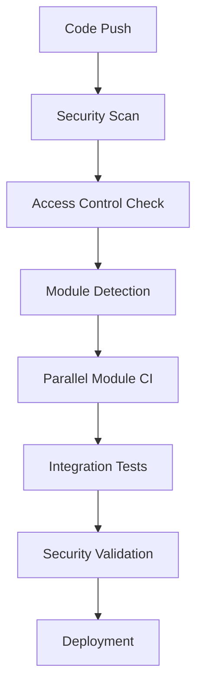

# 🔐 PhishNet Zero Trust DevOps Strategy

## 🎯 Overview

PhishNet implements a **Zero Trust DevOps model** where no developer has unrestricted access to the entire codebase. This ensures security, maintains code quality, and enforces separation of concerns across our multi-module architecture.

## 🏗️ Architecture & Access Control

### Module Structure
```
phishnet/
├── 🎨 client/          # Frontend React Application
├── ⚙️  server/          # Backend Node.js API
├── 🗄️  migrations/      # Database Schema Changes
├── 🔄 shared/          # Cross-module Types & Schemas
├── 📚 docs/            # Documentation
└── 🧪 tests/          # Testing Infrastructure
```

### Access Control Matrix

| Role | Frontend | Backend | Database | Shared | CI/CD | Admin |
|------|----------|---------|----------|--------|-------|--------|
| **Frontend Developer** | ✅ Full | ❌ None | ❌ None | ✅ Types | ❌ None | ❌ None |
| **Backend Developer** | ❌ None | ✅ Full | ❌ Read | ✅ Schema | ❌ None | ❌ None |
| **Database Developer** | ❌ None | ❌ Read | ✅ Full | ✅ Schema | ❌ None | ❌ None |
| **Full-Stack Developer** | ✅ Full | ✅ Full | ❌ Read | ✅ Full | ❌ None | ❌ None |
| **Team Lead** | ✅ Full | ✅ Full | ✅ Review | ✅ Full | ✅ Review | ❌ None |
| **Admin** | ✅ Full | ✅ Full | ✅ Full | ✅ Full | ✅ Full | ✅ Full |

## 🌿 Branching Strategy

### Branch Types & Access Control

```
main (Production)
├── 🔒 Protected: Requires ALL approvals
├── 🤖 Auto-deploy: Production environment
└── 📋 Access: Admin + Lead approval only

develop (Integration)
├── 🔒 Protected: Requires team lead approval  
├── 🤖 Auto-deploy: Staging environment
└── 📋 Access: All teams (with restrictions)

feature/* (Development)
├── 🔓 Open: Module-specific restrictions
├── 🧪 Testing: Module CI pipelines
└── 📋 Access: Based on module ownership

hotfix/* (Emergency)
├── 🚨 Emergency: Admin override allowed
├── 🚀 Fast-track: Reduced approval requirements
└── 📋 Access: Admin + Senior developers
```

### Branch Naming Convention

```bash
# Frontend features
feature/frontend/campaign-dashboard
feature/frontend/user-management-ui
feature/ui/responsive-design

# Backend features
feature/backend/email-service
feature/backend/auth-middleware
feature/api/campaign-endpoints

# Database features
feature/database/multi-tenant-indexes
feature/db/performance-optimization
feature/schema/audit-logging

# Cross-module features
feature/integration/api-contracts
feature/shared/type-definitions

# Hotfixes
hotfix/security/session-vulnerability
hotfix/critical/database-connection

# Release preparation
release/v2.1.0
```

## 🔐 Zero Trust Principles

### 1. **Principle of Least Privilege**
- Developers only access modules they work on
- No blanket repository access
- Time-limited access for integration work

### 2. **Mandatory Peer Review**
- All changes require team member approval
- Cross-module changes require multiple team approvals
- Security-sensitive code requires security team review

### 3. **Continuous Verification**
- Every commit triggers security scans
- Access permissions verified on each push
- Multi-tenancy isolation tested automatically

### 4. **Audit Everything**
- All access attempts logged
- Change tracking with detailed attribution
- Security events monitored and alerted

## 🚀 CI/CD Pipeline Security

### Pipeline Stages



### Security Gates

1. **Pre-commit Hooks**
   - Secret detection
   - Code formatting
   - Basic lint checks

2. **Push-time Validation**
   - Access control verification
   - File permission checks
   - Branch protection enforcement

3. **CI Pipeline Security**
   - Dependency vulnerability scanning
   - Static code analysis
   - License compliance checking

4. **Integration Security**
   - API contract validation
   - Multi-tenancy testing
   - Cross-module security verification

5. **Deployment Security**
   - Environment validation
   - Deployment approval workflows
   - Rollback capability verification

## 👥 Team Collaboration

### Frontend Team Workflow

```bash
# 1. Create feature branch
git checkout -b feature/frontend/new-dashboard

# 2. Work only in allowed directories
# ✅ Allowed: client/, shared/types/
# ❌ Forbidden: server/, migrations/

# 3. Commit changes
git add client/src/pages/dashboard/
git commit -m "feat: add campaign dashboard"

# 4. Push and create PR
git push origin feature/frontend/new-dashboard

# 5. Request review from frontend team
# Auto-assigned via CODEOWNERS
```

### Backend Team Workflow

```bash
# 1. Create feature branch
git checkout -b feature/backend/email-service

# 2. Work only in allowed directories  
# ✅ Allowed: server/, shared/schema.ts, shared/types/
# ❌ Forbidden: client/ (except for API contracts)

# 3. Implement with security focus
# - Validate organizationId isolation
# - Implement proper input validation
# - Add comprehensive logging

# 4. Cross-module integration
# For API changes affecting frontend:
# - Update shared/types/ for TypeScript contracts
# - Coordinate with frontend team for integration
# - Request frontend team review for API contracts
```

### Database Team Workflow

```bash
# 1. Create migration branch
git checkout -b feature/database/audit-logging

# 2. Work in allowed directories
# ✅ Allowed: migrations/, shared/schema.ts
# ❌ Forbidden: client/, server/ implementation

# 3. Create migration with security focus
# - Maintain multi-tenancy (organizationId foreign keys)
# - Add proper indexes for performance
# - Include rollback procedures

# 4. Schema updates
# Update shared/schema.ts
# Coordinate with backend team for implementation
# Request review from both database and backend teams
```

## 🔧 Development Environment Setup

### Individual Developer Environment

```bash
# 1. Clone with limited scope (if possible)
git clone --filter=blob:none https://github.com/gh0st-bit/PhishNet.git

# 2. Setup module-specific environment
cd PhishNet/phisnet

# Frontend developers
cd client && npm install
npm run dev  # Frontend only

# Backend developers  
cd server && npm install
npm run dev  # Backend only

# Full environment (for integration work)
npm run dev:all  # Requires approval
```

### Access Request Process

```bash
# Request additional module access
git checkout -b access-request/backend-integration
echo "Requesting backend access for API integration" > ACCESS_REQUEST.md
git add ACCESS_REQUEST.md
git commit -m "request: temporary backend access for API integration"
git push origin access-request/backend-integration

# Create PR with justification
# Team lead reviews and grants temporary access
# Access automatically revoked after merge
```

## 🚨 Security Incident Response

### Access Violation Detection

```bash
# Automated alerts for:
# 1. Unauthorized file modifications
# 2. Cross-module access without approval
# 3. Security-sensitive code changes without security review
# 4. Direct pushes to protected branches

# Incident response:
# 1. Immediate access revocation
# 2. Change rollback if necessary  
# 3. Security team investigation
# 4. Process improvement recommendations
```

### Emergency Procedures

```bash
# Critical security hotfix
git checkout -b hotfix/security/critical-vulnerability

# Emergency override process:
# 1. Admin approval required
# 2. Immediate security team notification
# 3. Expedited review process
# 4. Post-incident analysis mandatory
```

## 📊 Monitoring & Metrics

### Access Control Metrics
- Permission violations per week
- Cross-module access requests
- Security scan failure rates
- Deployment success rates by module

### Security Metrics
- Vulnerability detection time
- Time to patch critical issues
- Multi-tenancy isolation test results
- Failed access attempts

### Performance Metrics
- Module build times
- Integration test execution time
- Deployment pipeline duration
- Code review turnaround time

## 🎓 Training & Onboarding

### New Developer Onboarding

1. **Security Training**
   - Zero Trust principles
   - PhishNet-specific security requirements
   - Multi-tenancy best practices

2. **Module-Specific Training**
   - Assigned module architecture
   - Development workflow
   - Testing requirements

3. **Integration Training**
   - Cross-module communication patterns
   - API contract management
   - Security considerations

### Ongoing Education

- Monthly security updates
- Quarterly architecture reviews
- Annual Zero Trust policy updates

## 🔄 Continuous Improvement

### Process Evolution
- Regular access control audits
- Developer feedback integration
- Security threat model updates
- Performance optimization

### Tool Improvements
- Enhanced automation
- Better access control granularity
- Improved monitoring capabilities
- Streamlined approval workflows

---

**📧 Questions or Issues?**
- Security concerns: security-team@phishnet.dev
- Access requests: team-leads@phishnet.dev  
- Process improvements: devops-team@phishnet.dev

**🔒 Remember: Zero Trust means verify everything, trust nothing!**
